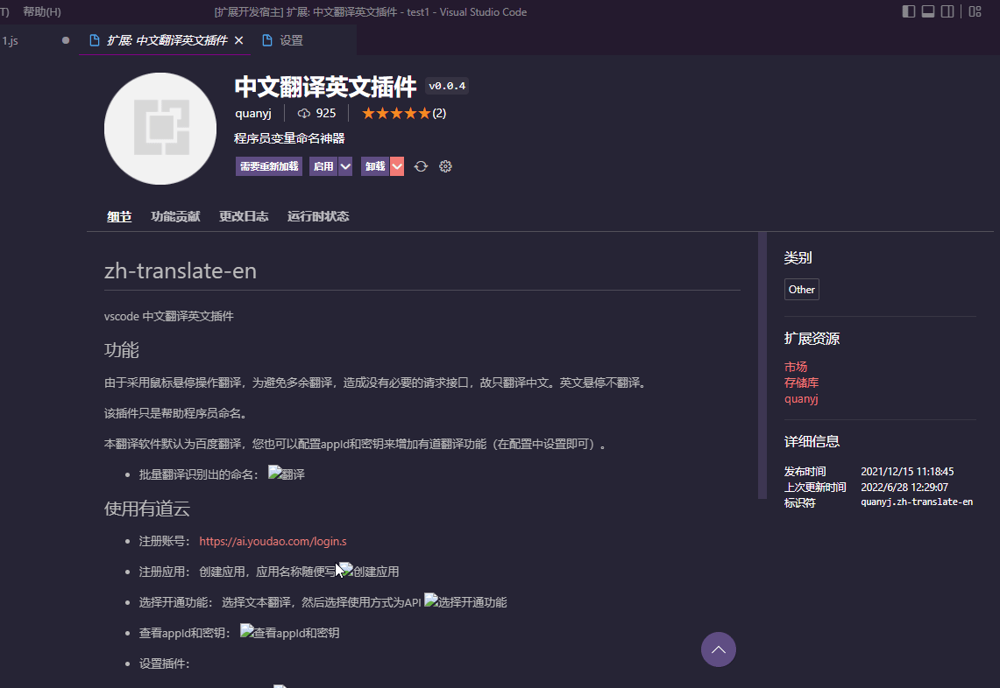
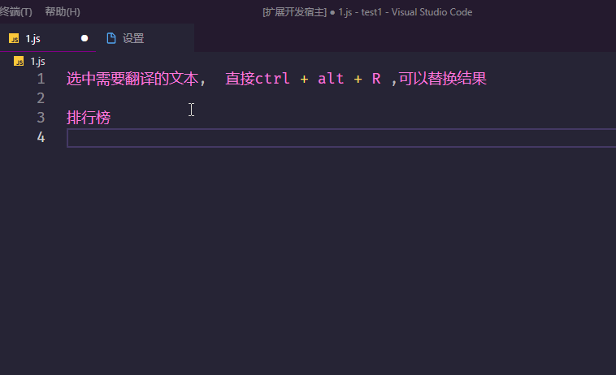
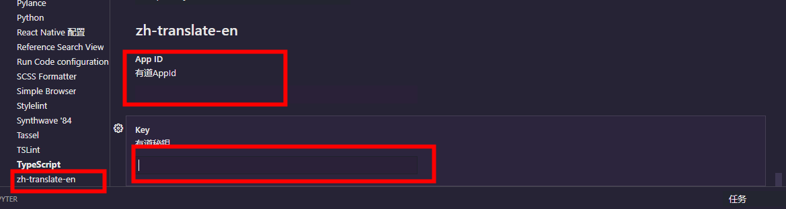

# zh-translate-en
vscode 中文翻译英文插件

## 更新日志
- 增强翻译结果自动复制到剪切板

- 支持直接替换翻译结果（智能算法选取最优翻译单词，进行替换）

- 缓存最后的结果，防止多次触发调用过多翻译

- 支持谷歌，有道，百度 可配置化

- 支持翻译状态展示，vscode 插件右下角。
  
- 优化悬浮提示
## 功能

由于采用鼠标悬停操作翻译，为避免多余翻译，造成没有必要的请求接口，故只翻译中文。英文悬停不翻译。

该插件只是帮助程序员命名。

本翻译软件默认内置谷歌翻译，百度翻译和有道翻译，谷歌和百度翻译不需额外操作，有道翻译需要配置默认的appId和appKey,当然你有百度的appId和appKey,也可以使用自己的。

默认三个翻译都是打开状态，这样能保障我们取到最优的翻译，当然带来的结果是翻译的时候稍微慢一点，自测可以接受。
如果你只想使用其中的一种翻译，可以在配置中停用即可。

- 1. 鼠标悬浮翻译中文：

- 2. 鼠标悬浮翻译中文,翻译结果自动粘贴到剪贴板，直接ctrl + v 来粘贴翻译结果：

- 3. 快捷操作，直接替换文本（智能选取最优翻译单词进行替换）：

- 3. 翻译状态实时展示：

## 使用有道云

- 注册账号：
https://ai.youdao.com/login.s

- 注册应用：
创建应用，应用名称随便写

- 选择开通功能：
选择文本翻译，然后选择使用方式为API

- 查看appId和密钥：
  
- 设置插件：
- 选择vscode 设置->扩展->zh-translate-en
 

## 使用百度翻译
- 注册账号：
http://api.fanyi.baidu.com/doc/12

ps: 百度通用翻译目前免费。

附录：代码命名规范：例如：welfare
|         | 变量名          |           | 方法名  |        | 类名  |
|  ----   | ----           |  ----     | ----   |  ----  | ----  |
| 变量     | welfare        |函数名      | fnWelfare  |类名     | Welfare |
| 常量     | WELFARE        |get方法     | getWelfare  |基类     | BaseWelfare |
| 列表     | welfareList    |set方法      | setWelfare  |异常类     | AbstractWelfare|
| 数组     | arrayWelfare   |事件方法     | onWelfare  |实现类     | WelfareImpl |
| 字典     | welfareMap   |删除方法     | deleteWelfare  |枚举类     | WelfareEnum |
| 数据对象     | welfareDO   |更新方法     | updateWelfare  |接口     | IWelfare |
| 数据传输对象     | welfareDTO   |回调方法     | callbackWelfare  |控制器名     | WelfareController|
| 展示对象     | welfareVO   |异步方法     | asyncWelfare  |服务名     | WelfareService|

## 打包 & 发布
- npm run package
- https://marketplace.visualstudio.com/manage/publishers/quanyj
 

